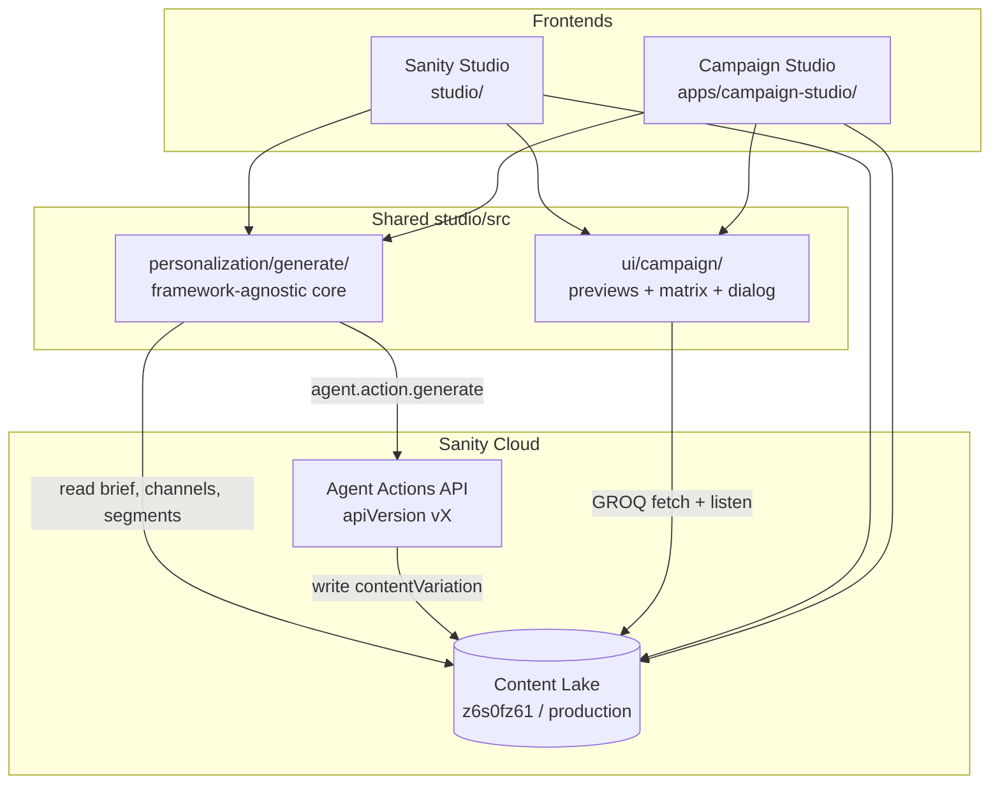

# Architecture — AT&T Multi-channel Personalization POC

This document explains how the demo fits together: content model, AI generation pipeline, shared UI, and the two frontends that consume them.

For setup and deploy commands, see the [README](../README.md). For field-level schema templates, see [PRD.md](./PRD.md) Appendix A.

---

## Overview

The POC demonstrates **one brief → many personalized variations**. A marketer defines a campaign brief once; Sanity AI (Agent Actions) generates channel- and segment-specific copy for each cell in a matrix. Editors preview the results in channel-accurate mockups and can toggle between raw merge tokens and resolved sample values.

Everything lives in a single Sanity project (`z6s0fz61`, dataset `production`). Two React apps read and write the same documents:

| Surface | Path | Audience | Primary jobs |
|---------|------|----------|--------------|
| **Sanity Studio** | `studio/` | Content ops / demo presenter | Edit briefs, run Generate, Variations tab, direct doc editing |
| **Campaign Studio** | `apps/campaign-studio/` | Marketer persona | Brief list/editor, scoped generate dialog, matrix preview, Open in Studio |

Both apps import shared code from `studio/src/` — the generation core and preview components are not duplicated.

---

## High-level diagram



---

## Monorepo layout

```
att-personalization/
├── studio/                         # Sanity Studio workspace
│   └── src/
│       ├── schemaTypes/            # Content model (documents + objects)
│       ├── structure/              # Desk + Variations document view wiring
│       ├── actions/                # "Generate variations" document action
│       ├── personalization/generate/   # Pure generation core (no React/sanity imports)
│       └── ui/campaign/            # Shared matrix, previews, CellViewDialog
└── apps/
    └── campaign-studio/            # App SDK shell (Vite + @sanity/sdk-react)
        └── src/                    # Brief list, editor, generate dialog, matrix
```

The App SDK app resolves `@studio/*` to `../../studio/src/*` via TypeScript paths and Vite alias. That lets Campaign Studio call `generateMatrix()` and render `WebHeroCard` without a separate npm package.

---

## Content model

Documents are defined in `studio/src/schemaTypes/`. The model separates **configuration** (seeded once), **input** (the brief), and **output** (variations).

### Configuration (seeded, hidden from "Create new")

| Type | Role |
|------|------|
| `channel` | Web, email, SMS — constraints, max length, format hints |
| `segment` | Audience slice (new, loyal, business, value) — brand voice, color, logo |
| `mergeField` | Token registry — `{{customer.firstName}}`, `{{offer.amount}}`, etc. |
| `product` | Featured product for Sanity-resolved `{{product.*}}` tokens |

See [SEED.md](./SEED.md) for document ids and sample values.

### Input

| Type | Role |
|------|------|
| `campaignBrief` | Marketer input — offer, key messages, targeting refs, optional `flowSteps` for abandoned-cart |

**Campaign types:**

- **Promotional** — one matrix: segments × channels (e.g. 4 × 3 = 12 cells)
- **Abandoned-cart** — one matrix **per flow step** (reminder, incentive, urgency), each step may target a subset of channels

### Output

| Type | Role |
|------|------|
| `contentVariation` | One generated cell — discriminated by `channel` field; only the matching embedded object (`web` / `email` / `sms`) is visible in the form |

Channel content shapes:

- `webContent` — headline, subheadline, CTA, hero image (AI-generated via `aiAssist.imageInstructionField`)
- `emailContent` — subject, preheader, portable-text body, CTA
- `smsContent` — message (≤160 chars, validated)

Each variation stores `status` (`pending` → `generating` → `generated` / `error`), `generatedFromBriefRev` (for out-of-date detection), and refs back to brief, channel, and segment.

---

## Variation identity

Every matrix cell has a **deterministic document id** so re-generation is idempotent:

```
variation.{briefId}.{stepKey}.{channelKey}.{segmentKey}
```

- Promotional briefs use `stepKey = default`
- Abandoned-cart uses the flow step key (`reminder`, `incentive`, `urgency`)
- Draft brief ids are normalized ( `drafts.` prefix stripped) so draft and published briefs share the same variation ids

Implemented in `studio/src/personalization/generate/ids.ts`.

---

## Generation pipeline

The core lives in `studio/src/personalization/generate/` and is **framework-agnostic** — it only imports types from `@sanity/client`, never `sanity` or React. Studio and the App SDK both call the same `generateMatrix()` entry point.

### Module responsibilities

| Module | Purpose |
|--------|---------|
| `ids.ts` | Deterministic variation ids + parse |
| `promptAssembly.ts` | Builds `{instruction, instructionParams, withImage}` per cell; all variable content via typed params, not string concat |
| `agentGenerate.ts` | **Only file** using `apiVersion: 'vX'` and `client.agent.action.generate` |
| `orchestrate.ts` | `generateMatrix(client, args)` — serial loop, placeholder docs, progress callbacks |
| `tokens.ts` | `extractTokens`, `resolveTokens`, `tokenChipMeta` for preview UI |

### Per-cell loop (`orchestrate.ts`)

For each `(flowStep × channel × segment)` cell:

1. **Fetch brief** — GROQ with `perspective: 'raw'` so draft-only briefs are visible
2. **createOrReplace placeholder** — `{status: 'generating'}` at the deterministic id
3. **buildPrompt** — channel constraints + segment brand voice + step intent + merge-field catalog
4. **agentGenerateVariation** — Agent Actions write scoped to the channel object (and hero image asset for web)
5. **Patch success** — `{status: 'generated', generatedAt, generatedFromBriefRev}` or `{status: 'error'}` on failure

Calls run **serially** — Agent Actions are beta, credit-sensitive, and rate-limited. The demo matrix is small enough that 12–20 sequential calls is acceptable.

### Agent Actions details (`agentGenerate.ts`)

- `schemaId`: `_.schemas.default` (must match deployed schema — see `studio/SCHEMA_ID.md`)
- `forcePublishedWrite: true` — variations land on published ids (matrix queries don't need draft perspective gymnastics)
- `operation: 'createOrReplace'` with `initialValues` seeding `channel`, `segment`, `flowStep`, and refs — required because schema `hidden` rules depend on `parent.channel`
- Web channel adds a second target path for `heroImage.asset`; image generation is **async** — previews null-guard missing assets

### Triggers

| Trigger | Location | Notes |
|---------|----------|-------|
| Studio document action | `studio/src/actions/generateVariations.tsx` | Confirmation dialog, toast progress |
| App SDK generate dialog | `apps/campaign-studio/src/views/GenerateDialog.tsx` | Scoped filters (channels, segments, steps), serial runner |
| Smoke script | `studio/scripts/smoke.ts` | CLI verification with `SANITY_AUTH_TOKEN` |

---

## Token / merge-field system

Generated copy includes merge tokens like `{{customer.firstName}}` and `{{offer.amount}}`. The `mergeField` registry defines each token's source:

| Source | Resolution |
|--------|------------|
| `external` | `sampleValue` from registry (simulates CRM/PIM) |
| `sanity` | GROQ resolver against the brief (e.g. `offer` field) |
| **Featured-product flip** | When `brief.featuredProduct` is set, `{{product.*}}` tokens resolve via the referenced product doc regardless of registry default |

Preview components use `TokenText` with two modes:

- **Raw** — colored chips (Sanity / external / unresolved)
- **Merged** — async `resolveTokens()` with sample values for demo

---

## Preview and matrix UI

Shared components in `studio/src/ui/campaign/`:

| Component | Role |
|-----------|------|
| `VariationMatrixView.tsx` | Studio document view — segments × channels grid, abandoned-cart stacked steps, live `client.listen` |
| `MatrixView.tsx` (App) | Same layout; imports shared previews |
| `CellViewDialog.tsx` | Per-cell "View" dialog at near-real scale; optional `extraFooter` slot for App-only actions |
| `WebHeroCard.tsx` | Full-bleed hero, gradient overlay, CTA |
| `EmailClientMock.tsx` | Inbox chrome, subject/preheader/body/CTA |
| `PhoneSmsBubble.tsx` | Phone frame, bubble, char counter (>160 red) |
| `TokenText.tsx` | Raw/merged token rendering |

All preview components accept `client` as a prop (App-SDK-compatible — no `useClient` from `sanity` inside them).

**Out-of-date badge:** when `generatedFromBriefRev !== brief._rev`, the cell shows a caution badge until re-generated.

---

## App SDK architecture

`apps/campaign-studio/src/App.tsx` wraps the tree in:

```tsx
<SanityApp config={[{projectId, dataset}]} fallback={...}>
  <Suspense>
    <CampaignStudio />
  </Suspense>
</SanityApp>
```

`CampaignStudio` is a simple view router:

```
list → edit (brief form) → matrix (variation preview)
```

- **BriefList** — all briefs, coverage stats
- **BriefEditor** — promotional + abandoned-cart fields, flow step editor
- **GenerateDialog** — calls `generateMatrix` with optional channel/segment/step filters
- **MatrixView** — shared previews + `OpenInStudioButton` (Suspense-wrapped deep link via `useNavigateToStudioDocument`)

Reads that must see draft briefs use `client.withConfig({perspective: 'raw'})`.

---

## Studio architecture

`studio/sanity.config.ts` wires:

- `structureTool({ defaultDocumentNode })` — adds **Variations** tab on `campaignBrief`
- `assist()` — Sanity AI Assist plugin
- `document.actions` — injects **Generate variations** for `campaignBrief` only
- Schema filters — hide `channel`, `segment`, `mergeField` from global "Create new" (admin-seeded types)

---

## Data flow summary

```
1. Admin seeds channels, segments, mergeFields, products, sample briefs
2. Marketer edits campaignBrief (Studio or App SDK)
3. User clicks Generate → generateMatrix loops cells serially
4. Each cell: placeholder → Agent Actions → contentVariation doc
5. Matrix view listens for changes and renders channel mockups
6. Editor toggles raw/merged tokens, opens CellViewDialog, or jumps to Studio doc
7. Brief edit bumps _rev → existing variations show "Out of date" until re-run
```

---

## Testing

Unit tests in `studio/src/personalization/generate/*.test.ts` use Vitest with a hand-rolled mock `SanityClient` (pure Node, no jsdom). They cover:

- Id generation and parsing
- Prompt assembly shape
- Token extraction and resolution (including featured-product flip)
- Full orchestration contract (cell counts, idempotency, error handling, progress events)

Run: `npm run test` from the repo root.

---

## Key design decisions

1. **Single `contentVariation` type** with embedded channel objects — field names must match Agent Actions `target.path` literals (`web`, `email`, `sms`).
2. **Framework-agnostic generate core** — Studio and App SDK can import the same orchestrator; only `agentGenerate.ts` touches experimental APIs.
3. **Deterministic ids + createOrReplace** — safe re-runs without duplicate docs.
4. **Shared preview components** — pixel parity between Studio Variations tab and App SDK matrix.
5. **Serial generation** — trades speed for predictable cost and rate-limit behavior on a beta API.
6. **Raw perspective for drafts** — briefs are seeded as drafts; generate and App reads must not use default `published` perspective alone.

---

## Related docs

| Doc | Contents |
|-----|----------|
| [README.md](../README.md) | Install, local dev, deploy |
| [PRD.md](./PRD.md) | Full spec, schema templates (Appendix A), UI patterns (B–E) |
| [SEED.md](./SEED.md) | Seeded document ids and sample briefs |
| [SCHEMA_ID.md](../studio/SCHEMA_ID.md) | Deployed schema id and Studio app id |
